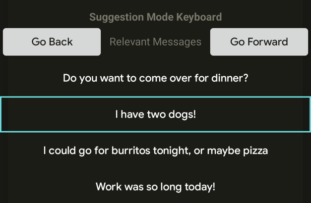
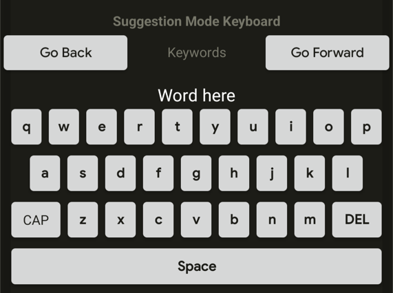
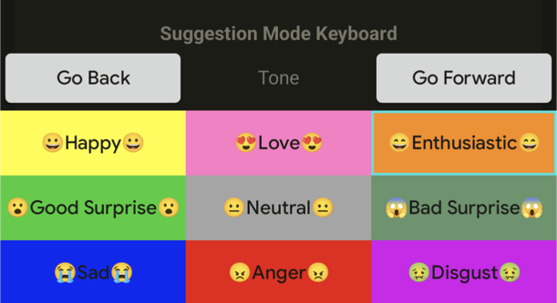
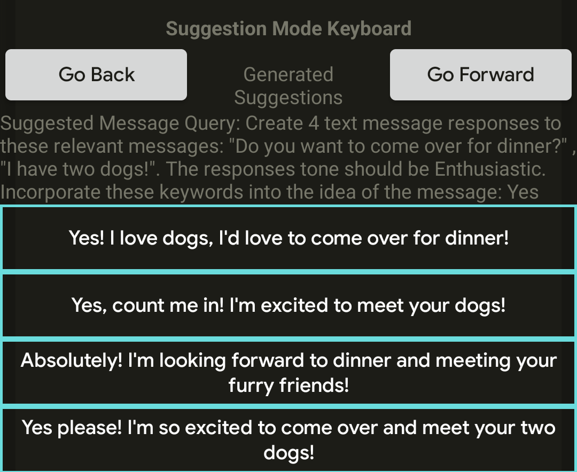

# SuggestionBasedKeyboard--LMU

The Suggestion Based Keyboard Software Project is the culmination of my work in HCI as a DAAD RISE Germany intern at LMU Munich during the Summer of 2023. Below is a purpose statement for the application and some instructions on how to run the project.

Date: Summer 2023

Member: Riley Fiske

## Purpose

The Sugggestion Based Keyboard serves the purpose of providing an alternative use or extension on the "suggested/predicted words" bar at the top of a mobile keyboard and utilize LLMs to generate whole message suggestions given different contexts. The contexts used for this study were relevant/previous messages, keywords, and tone. Four suggested messages are then generated which can populate the compose line and allow further customization by the user.

## Instructions

1) languagelogger-app-6 is the keyboard application and when launched, will boot up the Research-IME Homepage to configure your keyboard. This does nothing but has not yet been removed.

2) suggestionKeyboardResearchApplication is the messaging application used. It is very bare bones and serves the purpose of being able to read it recently sent messages to be loaded on the keyboard as relevant messages

3) suggestionKeyboardResearchApplication should work with the newest version of Android Studio and many earlier versions. Very few problems should be involved in getting this to launch. Tell me if that is not the case! I got it to work on Android Studio Giraffe 2022.3.1 Patch 1, Gradle Plugin 8.1.1, Gradle Version 8.0, and Compile SDK 33.

4) languagelogger-app-6 loaded for me on Android Studio Arctic Fox 2020.3.1 RC1. You may try to get it to load on later versions, but a gradle upgrade is then required which creates many other problems that snowball into a large headache.

5) The gradle settings used for this application are:
 - Android Gradle Plugin Version: 3.1.4
 - Gradle Version: 4.6
 - Gradle JDK: 1.8

6) When launching the keyboard application, first build it, it will throw some errors, clean the project, then build the project once again and it should work!

 Message me if I seem to be forgetting anything!

 -Riley
